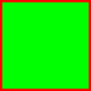
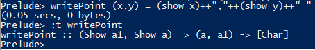
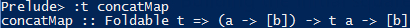
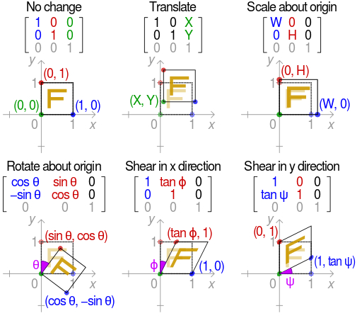
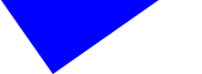
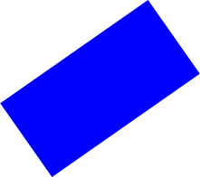
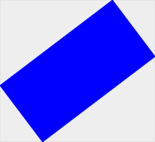
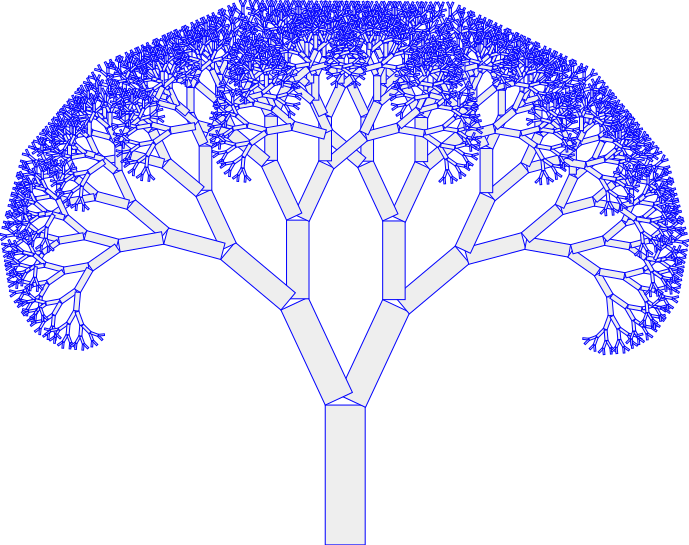
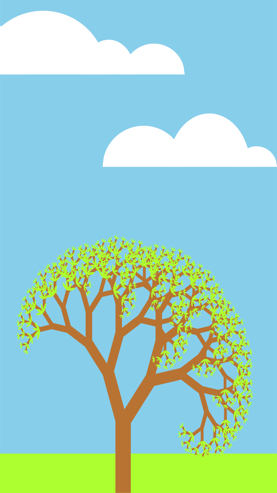

# Lecture Notes

## Aims of this Lecture

* Understand how the Bounding Box image was created
  * The svg generation
  * How the initial Square was made
    * [Affine transformations](https://en.wikipedia.org/wiki/Affine_transformation)
    * DataTypes.hs and Haskell's module structure
  * How we can use Haskell's type system to make the bounding box
* Understand how the tree was created (hopefully...)

## What is SVG?

``` svg
<svg height="200" width="200" xmlns="http://www.w3.org/2000/svg"> shape stuff here </svg>
```

  * A list of 'polygons' which can also contain attributes  
``` svg
<polygon points="0,0 0,100 100,100 100,0 " style="fill:#00FF00;stroke:rgb(255,0,0);stroke-width:5"/>
```

Finally the full SVG for two polygons would be as such:  
``` svg
<svg height="200" width="200" xmlns="http://www.w3.org/2000/svg">
    <polygon points="0,0 0,100 100,100 100,0 " style="fill:#00FF00;stroke:rgb(255,0,0);stroke-width:5"/>
    <polygon points="100,100 100,200 200,200 200,100 " style="fill:#00FF00;stroke:rgb(255,0,0);stroke-width:5"/>
</svg>
```

Which when rendered looks like such:  


## Using Haskell to Produce SVG

Thinking about the SVG in a different way.
 
``` Haskell
type Point          = (Float, Float) --generic point of polygon
type Polygon        = [Point] --generic shape
type Figure         = [Polygon] --a figure contains a list of shapes
```

Using these types:
``` Haskell
{- This function takes a Point and returns a string which is formatted as
an svg point. -}
writePoint :: Point -> String 
writePoint (x,y) = (show x)++","++(show y)++" "
```

---
  
  
And the type of this function is now:
``` Haskell
writePoint (show a1, show a) => (a, a1) -> [Char]
```
 
``` Haskell
show :: Show a => a -> String
```

---

More types from DataTypes.hs:  

``` Haskell
type FullPolygon    = (Fill, Outline, Polygon)

type Outline        = (Int,Int,Int)
type Fill           = (Int,Int,Int,Int,Int,Int)
```
Now the function which actually produces the String:  
``` Haskell
writeFullPolygon :: FullPolygon -> String
writeFullPolygon ((r1,r2,g1,g2,b1,b2),(r,g,b),p) = 
    "<polygon points=\""++(concatMap writePoint p)++"\" style=\"fill:#"++(f)++";stroke:rgb("++(show r)++","++(show g)++","++(show b)++");stroke-width:"++(show strokewidth)++"\"/>\n" where
    f = (writeHex r1)++(writeHex r2)++(writeHex g1)++(writeHex g2)++(writeHex b1)++(writeHex b2)
```

Looking closely this is a heaviliy Pattern matched tuple of tuples. We extract all
the colour infomation right here, and also seperate the polygon from its metadata.  
``` Haskell
(Fill, Outline, Polygon)

Fill <= (r1,r2,g1,g2,b1,b2)
Outline <= (r,g,b)
Polygon <= p
```

Meat of the function:
``` Haskell
"<polygon points=\""++(concatMap writePoint p)
```
Function composition:   
  

Boring sutff:  
``` Haskell
++"\" style=\"fill:#"++(f)++";stroke:rgb("++(show r)++","++(show g)++","++(show b)++");stroke-width:"++(show strokewidth)++"\"/>\n" where
    f = (writeHex r1)++(writeHex r2)++(writeHex g1)++(writeHex g2)++(writeHex b1)++(writeHex b2)
```

So this part basically just appends all the metadata to the tag, writeHex is just a utility method:  
``` Haskell
writeHex :: Int -> String
writeHex x = map toUpper (showHex x [])
```

---
More types! Once again, these types are from DataTypes.hs:  
``` Haskell
type FullFigure     = [FullPolygon]
``` 

The big function which is what we will use the  generate a
bounding box demo.  
``` Haskell
writeFullFigure :: FullFigure -> String
writeFullFigure f = "<svg height=\""++height++"\" width=\""++width++"\" xmlns=\"http://www.w3.org/2000/svg\">"++(concatMap writeFullPolygon f)++"</svg>" where
    (x,y) = (findCanvasFull f)
    height = (show y)
    width = (show x)
```
The important part:  
``` Haskell
(concatMap writeFullPolygon p)++"</svg>"
```

The boring attribute part: 
``` Haskell
"<svg height=\""++height++"\" width=\""++width++"\" xmlns=\"http://www.w3.org/2000/svg\">" where
    (x,y) = (findCanvasFull f)
    height = (show y)
    width = (show x)
```

The thing about this function is that it uses another function called 
`findCanvasFull` which gets the height and width, we will come back to
this later. 

---

Saving the String to a file:
``` Haskell
publishFullFigure :: FullFigure -> IO ()
publishFullFigure fig = writeFile "svg/Output.svg" $ writeFullFigure fig
```  
This `writeFile` function will output the String from `writeFullFigure`
and put it in the file "svg/Output.svg" so that we can view it.

## Building the initial rectangle

### Useful Maths

Affine transformations! (read the wiki if you actually want to understand more)

TL:DR  
  
We convert these transformations into matrices as in Utils.hs and we get functions which do all this maths
for us. This is when haskell shines!
``` Haskell
type Transformation = (Float, Float, Float, Float, Float, Float)

translate :: Float -> Float -> Transformation
translate x y = (1,0,x,0,1,y)

scale :: Float -> Float -> Transformation
scale w h = (w,0,0,0,h,0)

rot :: Float -> Transformation
rot theata = (cos x, sin x, 0, -sin x, cos x, 0) where
    x = theata * (pi / 180)

shear :: Float -> Float -> Transformation
shear phi psi = (1,tan x,0,tan y,1,0) where
    x = phi * (pi / 180)
    y = psi * (pi / 180)
```  
Now we just need a function to apply a matrix mutliplication:  
``` Haskell
matrixMult :: Point -> Transformation -> Point
matrixMult (x, y) (a, b, c, p, q, r) = 
    ((x * a + y * b + c),(x * p + y * q + r))
```  
Now we can use function composition to allow us to transform any shape, 
even if it is an incredibly long list of points.  
``` Haskell
(|=>) :: [Transformation] -> Polygon -> Polygon
(|=>) trList poly = map f poly where
    f = (\point -> foldr transformPoint point trList)
```  

example: 
``` Haskell 
[(translate 10 10),(rot 10)] |=> SomePoly
```  
If we compose one more composite function we can make this mathmatical
even more useful:  
``` Haskell
transformFigure :: [Transformation] -> Figure -> Figure
transformFigure trList = map f where
    f = (\x -> trList |=> x)
```  
And with this function we can now transform any of our shape datatypes. 
This will be helpful later on.

### Actual code

Finally the code for the blue square:  
``` Haskell
blueSq :: FullFigure
blueSq = [(blueF,blueL,[(rot 35),(scale 2 1)] |=> square)]
```  
There are a lot of brackets to get your head around, but it is only
a list of a single 3 valued tuple. `[(x,y,z)]` Where `x` is the fill of
the shape, `y` is the outline and `z` is the polygon. `z` extracted is:
``` Haskell
[(rot 35),(scale 2 1)] |=> square

square :: Polygon
square = [(0,0),(0,100),(100,100),(100,0)]
```  

So the result of this `blueSq` function if we convert it to svg is:  
  
Well thats not a square...

What happened is, the svg engine treats the top left corner as 0,0. And 
since all our maths for transformations rotates everything about 0,0 we
actually rotate most of the square into negative pixels.
Lets check the svg produced by our program:  
``` svg
<svg height="81.91521" width="221.18805" xmlns="http://www.w3.org/2000/svg">
    <polygon points="0.0,0.0 57.357643,81.91521 221.18805,-32.80008 163.83041,-114.71529 " style="fill:#0000FF;stroke:rgb(0,0,255);stroke-width:0.1"/>
</svg>
```  

After running it through a function which fixes our problem, then converting it to svg we
get:  
  
That looks better!

And our new svg looks like such:

``` svg
<svg height="196.6305" width="221.18805" xmlns="http://www.w3.org/2000/svg">
    <polygon points="0.0,114.71529 57.357643,196.6305 221.18805,81.91521 163.83041,0.0 " style="fill:#0000FF;stroke:rgb(0,0,255);stroke-width:0.1"/>
</svg>
```  
no negatives!

## Building the Bounding Box

First we need to revist a function we brushed over earlier 
`findCanvasFull` which we used to get the height and width of a Figure
so that we could add to the svg metadata tags:  
``` Haskell
writeFullFigure :: FullFigure -> String
writeFullFigure f = "<svg height=\""++height++"\" width=\""++width++"\" xmlns=\"http://www.w3.org/2000/svg\">"++(concatMap writeFullPolygon f)++"</svg>" where
    (x,y) = (findCanvasFull f)
    height = (show y)
    width = (show x)
```  
Lets look at the definition for `findCanvasFull` since currently its a 
black box:
``` Haskell
findCanvasFull :: FullFigure -> Point
findCanvasFull fig = (findBBFigure $ fullFigtoFig fig) !! 2
```  
First lets explain the random `!!` which is the haskell infix function.
``` Haskell
fullFigtoFig :: FullFigure -> Figure
```  
Finally `findBBFigure` which is core part of this function. It stands
for *find-bounding-box-of-Figure*. Which is sounds awfully convenient...

``` Haskell
findBBFigure :: Figure -> Polygon
findBBFigure = findBBPolygon . concat 

findBBFullFigure :: FullFigure -> Polygon
findBBFullFigure = findBBFigure . fullFigtoFig

findBBPolygon :: Polygon -> Polygon
findBBPolygon = findBB_help . unzip 

findBB_help :: ([Float],[Float]) -> Polygon
findBB_help (x,y) = [(minx, miny),(minx, maxy), (maxx, maxy),(maxx, miny)] where
    minx = minimum x
    maxx = maximum x
    miny = minimum y
    maxy = maximum y
```  
The full stop means function composition, but in the more mathmatical sense
so this code below is equal:
``` Haskell
findBBFigure   = findBBPolygon . concat
findBBFigure x = findBBPolygon . concat x
findBBFigure x = findBBPolygon (concat x)
```  

That means the function for the grey bounding box is simply:  
``` Haskell
greySq = [(greyF,greyL,findBBFullFigure blueSq)]
```

Then the code for the full image you can see on the README is:
``` Haskell
boundingBox = publishFullFigure $ centreFullFigure $ blueSq++greySq where
    greySq = [(greyF,greyL,findBBFullFigure blueSq)]
    blueSq = [(blueF,blueL,[(rot 35),(scale 2 1)] |=> square)]
```

Rendered it looks like this:  


---

## The tree

Since we have most of the ground work; the only real extra code we need is a way to write
a recursive shape. This can be done in one function since we can compose lots of functions
to get the complexity of a tree:

``` Haskell
recursivePolygon_adv :: a -> (a -> a) -> Int -> [a]
recursivePolygon_adv basePolygon transFunc iter =
    if iter > 0
        then basePolygon:(recursivePolygon_adv (transFunc basePolygon) transFunc (iter - 1))
        else []

recursiveFigure_adv :: [a] -> (a -> a) -> Int -> [[a]]
recursiveFigure_adv baseFigure transFunc iter =
    map f baseFigure where
    f = (\poly -> recursivePolygon_adv poly transFunc\\ iter)
```

Then using these functions to create the tree:

``` Haskell
recTree = publishFullFigure $ colourizeFig greyF blueL finalTree where
    finalTree = centreFigure $ concat $ concat tree
    tree = recursiveFigure_adv base treeFunc 10
    base = [[[(scale 0.4 1.4)] |=> square]]
    treeFunc = (\fig -> (leaf1 fig)++(leaf2 fig))
    leaf1 = map (\x -> [(translate 14 (-140)),(scale 0.75 0.75),(rot (-20))] |=> x)
    leaf2 = map (\x -> [(translate 0 (-140)),(scale 0.75 0.75),(rot 20)] |=> x)
```

Which when rendered looks like:


Thanks for listening!

## END

Pretty pictures also made with my code:  


