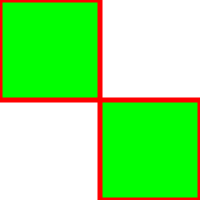
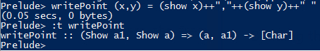

# Lecture Notes

## Aims of this Lecture

* Understand how the Bounding Box image was created
  * The svg generation
  * How the initial Square was made
    * [Affine transformations](https://en.wikipedia.org/wiki/Affine_transformation)
    * DataTypes.hs and Haskell's module structure
  * How we can use Haskell's type system to make the bounding box

### What is SVG?

So an in-depth understanding of svg isn't crucial to understanding the rest of this program.
Hence why i am going to cover only the basics. Firstly svg stands for Scalable Vector Graphics.
And it is essentially a mark-up language which can be used to create vector shapes.
For our purposes we can consider svg to be made of 2 main components:
  * A start tag, which contains the attributes and metadata about the graphic.  
``` svg
<svg height="200" width="200" xmlns="http://www.w3.org/2000/svg"> shape stuff here </svg>
```

  * A list of 'polygons' which can also contain attributes  
``` svg
<polygon points="0,0 0,100 100,100 100,0 " style="fill:#00FF00;stroke:rgb(255,0,0);stroke-width:5"/>
```

This polygon we just defined is a list of x,y points. It goes from one point to the next
so this will draw a line from 0,0 to 0,100 then to 100,100 then 100,0 and
implicitly it goes back to the starting point as its a polygon.  
It also has fill specified by the Hex code and the outline is 5 pixels thick and is coloured
by the rgb value.  
Finally the full SVG for two polygons would be as such:  
``` svg
<svg height="200" width="200" xmlns="http://www.w3.org/2000/svg">
    <polygon points="0,0 0,100 100,100 100,0 " style="fill:#00FF00;stroke:rgb(255,0,0);stroke-width:5"/>
    <polygon points="100,100 100,200 200,200 200,100 " style="fill:#00FF00;stroke:rgb(255,0,0);stroke-width:5"/>
</svg>
```

Which when rendered looks like such:  


### Using Haskell to Produce SVG

Thinking about the SVG in a different way: if we think about what a polygon actually is,
it can really be broken down into a list of points. Where each point is an x,y value.  
By looking at a snippet from DataTypes.hs I have made some new types in Haskell which 
are essentially this concept. This will allow us to manipulate and take advantage of 
using a functional language to create intresting shapes.  
``` Haskell
type Point          = (Float, Float) --generic point of polygon
type Polygon        = [Point] --generic shape
type Figure         = [Polygon] --a figure contains a list of shapes
```

The code above now gives more meaningful names to the types we are going to use, but it doesn't
actually do anything yet. For that we need functions!  
The first function we are going to look at is called `writePoint` and it is defined as such:  
``` Haskell
{- This function takes a Point and returns a string which is formatted as
an svg point. -}
writePoint :: Point -> String 
writePoint (x,y) = (show x)++","++(show y)++" "
```

Since this is the first function we are looking at; lets go through each step in this function.
First the type definition. Which is called a type definition becuase it specifies the type of the function
and since Haskell is all about type checking its considered good practice to tell Haskell what type our function
is going to be explicitly.  
``` Haskell 
writePoint :: Point -> String
```

All this line does is tell the compilier what the function is, we are saying, "I would like a function called
writePoint, who's type is Point to String". This line is actually completely optional as we can compile just the function definition and Haskell will infer the types:  
  
And the type of this function is now:
``` Haskell
writePoint (show a1, show a) => (a, a1) -> [Char]
```

Although this type is now much harder to read and it less expressive compared to what we started with even though its still
the same function. Now for the actual code part of the function:  
``` Haskell
writePoint (x,y) = (show x)++","++(show y)++" "
```

Firstly this function takes a point as it's argument and since we are 
garenteed to know its type we can safely pattern match out each side
of the tuple. Hence the parameter is (x,y). Then the rest of the function
is pretty simple if we know what show does (++ is concatenate). And show's type is as follows:  
``` Haskell
show :: Show a => a -> String
```

Which is basically anything to String, which is pretty helpful since we need the point to become a
string. So writePoint will convert the x to a string, concatenate it with "," then
concatenate that with y which is also converted to a string, then finally concatenate
an extra " ". Giving us a function which is essentially a .toString for points.

---

Now we need a function which produces the full SVG polygon tag with all the attributes included.
And for that we need some more types from DataTypes.hs:  
``` Haskell
type FullPolygon    = (Fill, Outline, Polygon)

type Outline        = (Int,Int,Int)
type Fill           = (Int,Int,Int,Int,Int,Int)
```

Think of Outline line as the stroke r,g,b values, and Fill is the hex values
for the fill of the polygon. And we have already seen a polygon type, so this FullPolygon
type is just a tuple of the key peices of infomation we need for the SVG tag.  
Now the function which actually produces the String:  
``` Haskell
writeFullPolygon :: FullPolygon -> String
writeFullPolygon ((r1,r2,g1,g2,b1,b2),(r,g,b),p) = 
    "<polygon points=\""++(concatMap writePoint p)++"\" style=\"fill:#"++(f)++";stroke:rgb("++(show r)++","++(show g)++","++(show b)++");stroke-width:"++(show strokewidth)++"\"/>" where
    f = (showHex r1)++(showHex r2)++(showHex g1)++(showHex g2)++(showHex b1)++(showHex b2)
```

First the type of this function is pretty self-explanatory, it takes a FullPolygon
and outputs a String which is exactly what we are looking for.

### Building the initial square

